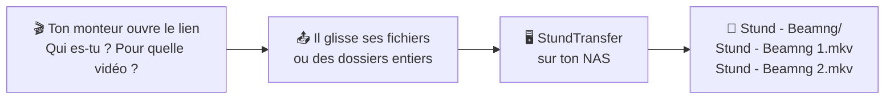

<div align="center">

# 📦 StundTransfer

**Le dépôt de rushs vidéo, directement sur ton NAS.**

Un lien, un nom, une vidéo : les fichiers arrivent rangés dans le bon dossier.<br>
Pas de compte à créer, pas de limite de taille, pas de cloud entre les deux.

[](https://github.com/StundZow/StundTransfer/actions/workflows/stundtransfer-image.yml)
[](https://github.com/StundZow/StundTransfer/pkgs/container/stundtransfer)
[](#installation)
[](https://github.com/StundZow/StundTransfer/blob/stundtransfer/LICENSE)

</div>

## Comment ça marche



1. **La personne dit qui elle est et pour quelle vidéo**, puis glisse ses fichiers ou des dossiers entiers.
2. **L'envoi part à pleine vitesse**, en plusieurs morceaux à la fois. Si la connexion coupe ou si la page se recharge, ça reprend où ça s'était arrêté.
3. **Tout arrive rangé** dans `Dossier de réception/Nom - Vidéo/`, un dossier par dépôt. Aucun fichier n'est jamais écrasé.

## Ce qu'il y a dedans

- 🙅 **Aucun compte pour déposer** : on arrive directement sur la page d'envoi, sans inscription ni page de connexion.
- 🚀 **Pleine vitesse** : morceaux de 20 Mo envoyés en parallèle, réessais automatiques, reprise après une coupure.
- 📁 **Rangement automatique** : un dossier `Nom - Vidéo` par dépôt (`(2)`, `(3)`… si le nom existe déjà), avec l'arborescence des dossiers d'origine.
- ✏️ **Renommage avant l'envoi** : un crayon à côté de chaque fichier. Les fichiers d'OBS ou d'appareil photo (`2026-07-22 14-32-10.mkv`, `IMG_1234.MOV`) deviennent automatiquement `Stund - Beamng 1.mkv`, `2`, `3`…
- 🛡️ **Espace admin** : tous les dépôts reçus, le choix du dossier de réception et des liens de partage pour envoyer des fichiers à quelqu'un.
- 🎨 **À ton image** : nom, logo, couleurs, thème et réglages se changent depuis l'interface, sans toucher au code.
- 🇫🇷 **En français**, avec l'anglais disponible.

## Installation

Pour un NAS **Synology à processeur Intel ou AMD** (gamme « + » : DS224+, DS225+, DS423+…) avec **Container Manager**.

1. **Crée un utilisateur DSM dédié** (ex. `stundtransfer`) avec Lecture/Écriture uniquement sur le dossier partagé des rushs et sur `docker`. Note son numéro avec `id stundtransfer` en SSH.
2. **Crée le dossier** `docker/stundtransfer`.
3. **Container Manager → Projet → Créer**, avec ce `compose.yaml` (adapte les chemins de gauche et le numéro) :

   ```yaml
   services:
     stundtransfer:
       image: ghcr.io/stundzow/stundtransfer:latest
       container_name: stundtransfer
       restart: unless-stopped
       ports:
         - 3000:3000
       environment:
         - TRUST_PROXY=true
         - PUID=1031   # numéro de l'utilisateur dédié
         - PGID=1031   # le même numéro (pas 100)
         - STUNDTRANSFER_ROOT_DIR=/nas
       volumes:
         - /volume1/docker/stundtransfer/data:/opt/app/backend/data
         - /volume1/docker/stundtransfer/data/images:/opt/app/frontend/public/img
         - /volume1/Rushs:/nas   # ton dossier partagé des rushs
   ```

4. **Ouvre** `http://<ip-du-nas>:3000/auth/signUp` : le premier compte créé est administrateur.
5. **Administration → Paramètres** : désactive les inscriptions (Sécurité & Accès), puis active le **Dépôt public** (StundTransfer). Choisis le dossier de réception dans **Administration → Dossier de réception**.
6. **Accès depuis internet** : adresse DDNS, certificat Let's Encrypt et proxy inversé DSM (HTTPS 443 → `localhost:3000`). N'ouvre jamais le port 3000 sur ta box.

Le guide complet (réglages, droits, mises à jour) est dans [STUNDTRANSFER.md](https://github.com/StundZow/StundTransfer/blob/stundtransfer/STUNDTRANSFER.md).

## Mettre à jour

Container Manager → **Projet** → **Arrêter** puis **Nettoyer** → **Image** : supprime `ghcr.io/stundzow/stundtransfer` → **Projet** → **Construire**.

## Basé sur Pingvin Share X

StundTransfer est une fork de [Pingvin Share X](https://github.com/smp46/pingvin-share-x) (smp46), elle-même issue de [Pingvin Share](https://github.com/stonith404/pingvin-share) (Elias Schneider). Merci à eux 🐧

- Le code de StundTransfer est sur la branche [`stundtransfer`](https://github.com/StundZow/StundTransfer/tree/stundtransfer). La branche `main` suit le projet d'origine.
- Le partage de fichiers d'origine reste disponible pour les admins.
- Licence [BSD 2-Clause](https://github.com/StundZow/StundTransfer/blob/stundtransfer/LICENSE), comme le projet d'origine.
